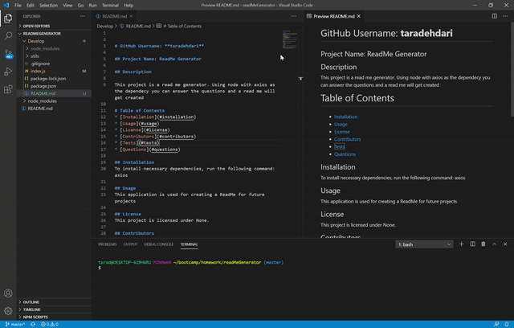

# GitHub Username: **taradehdari**

## Project Name: ReadMe Generator

## Description

This project is a read me generator. Using node with axios as the dependecy you can answer the questions and a read me will get created

# Table of Contents 
* [Installation](#installation)
* [Usage](#usage)
* [License](#license)
* [Contributors](#contributors)
* [Tests](#tests)
* [Questions](#questions)

## Installation
To install necessary dependencies, run the following command: axios

## Usage
This application is used for creating a ReadMe for future projects

## License
This project is licensed under None.

## Contributors
  undefined

## Tests
To run tests, you need to run the following command: node index.js

## Questions
If you have any questions about the repo, open an issue or contact me directly at tara.dehdari@gmail.com.

## Gif Video
